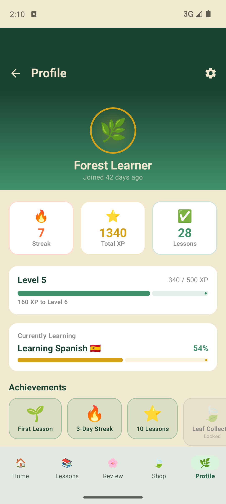
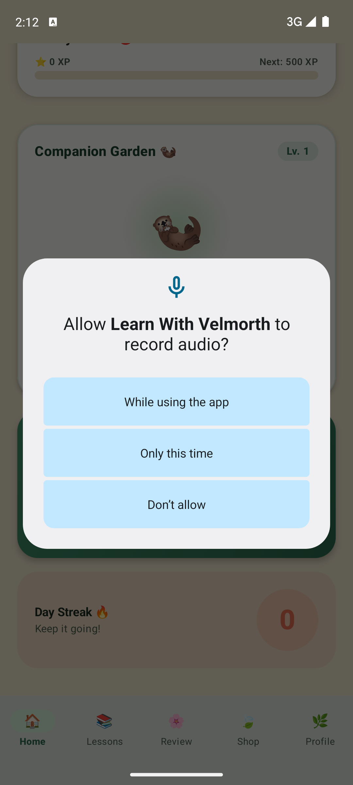

# 🌿 Learn With Velmorth

> A beautiful, offline-first Android language learning app with a forest theme, companion mascot, and gamified lessons.

---

## 📸 Screenshots

### Home Screen


### Lesson Player & Quiz


---

## ✨ Features

- 🌿 **Forest-themed UI** — Deep green Material 3 design with warm cream tones
- 🦦 **Velmorth Mascot** — Interactive companion with moods (Happy, Excited, Hungry, Sleepy)
- 📚 **Lesson Path** — Chapter-based language lessons with vocabulary & grammar
- 🎯 **Quiz Mode** — Multiple choice, fill-in, and audio recognition questions
- 🌸 **Review Garden** — Spaced repetition flashcard system
- 🍃 **Leaf Economy** — Earn leaves for completing lessons, spend in the shop
- 🔥 **Daily Streaks** — Motivation tracking with streak protection
- 🎤 **AI Speaker** — Pronunciation practice (Premium feature)
- 💎 **Premium Paywall** — Unlock advanced content and features
- 👤 **Profile & Stats** — XP, level, badges, and learning history
- ⚙️ **Settings** — Theme, notifications, language preferences
- 📴 **Offline-first** — Room database, works without internet

---

## 🛠️ Tech Stack

| Layer | Technology |
|---|---|
| Language | Kotlin |
| UI Framework | Jetpack Compose + Material 3 |
| Navigation | Navigation3 (alpha) |
| DI | Hilt |
| Local DB | Room |
| Async | Kotlin Coroutines + Flow |
| Image Loading | Coil |
| Animations | Lottie + Compose Animations |
| Preferences | DataStore |
| Background | WorkManager |
| Fonts | Google Fonts (Playfair Display, Nunito) |
| Authentication | Firebase Auth (in progress) |
| Cloud Sync | Firestore (planned) |
| AI Integration | Gemini API (planned) |

---

## 🏗️ Project Structure

```
LearnWithVelmorth/
├── app/src/main/java/com/example/learnwithvelmorth/
│   ├── MainActivity.kt
│   ├── VelmorthApplication.kt
│   ├── Navigation.kt          ← NavDisplay + bottom bar
│   ├── NavigationKeys.kt      ← Type-safe nav keys
│   ├── data/
│   │   ├── local/
│   │   │   ├── db/            ← Room database
│   │   │   ├── dao/           ← DAOs
│   │   │   ├── entities/      ← Room entities
│   │   │   └── auth/          ← Firebase Auth service
│   │   └── repository/        ← Repository implementations
│   ├── domain/
│   │   ├── model/             ← Domain models (User, Lesson, etc.)
│   │   └── repository/        ← Repository interfaces
│   ├── di/                    ← Hilt modules
│   ├── theme/                 ← Colors, Typography, Shapes
│   └── ui/
│       ├── components/        ← Shared UI components
│       └── screens/           ← 12 screens
│           ├── splash/
│           ├── onboarding/
│           ├── auth/          ← Login/Register screens
│           ├── home/
│           ├── lessons/
│           ├── lessonplayer/
│           ├── quiz/
│           ├── review/
│           ├── aispeaker/
│           ├── shop/
│           ├── premium/
│           ├── profile/
│           └── settings/
├── app/src/main/assets/
│   └── db/lessons_seed.json   ← Seed data
└── .github/workflows/         ← CI/CD pipelines
    ├── build.yml              ← Build & test checks
    └── lint.yml               ← Code quality
```

---

## 🚀 Getting Started

### Prerequisites

- Android Studio Ladybug (2024.2.1) or newer
- JDK 17+ (bundled with Android Studio)
- Android SDK 36
- Min SDK: Android 7.0 (API 24)

### Setup

1. **Clone the repo**
   ```bash
   git clone https://github.com/manish63018-sketch/learn-with-velmorth.git
   cd learn-with-velmorth
   ```

2. **Set up API keys**
   ```bash
   # Copy the example file
   cp apikey.properties.example apikey.properties
   # Edit apikey.properties and add your real keys
   ```

3. **Open in Android Studio**
   - File → Open → select the project folder
   - Let Gradle sync complete

4. **Run the app**
   - Connect a device or start an emulator
   - Press ▶ Run

> **Note:** `local.properties`, `apikey.properties`, and `google-services.json` are in `.gitignore` and must never be committed.

---

## 🔐 Security

This project follows secure credential management:

| File | Status | Reason |
|---|---|---|
| `local.properties` | 🚫 gitignored | Contains local SDK path |
| `apikey.properties` | 🚫 gitignored | Contains real API keys |
| `google-services.json` | 🚫 gitignored | Firebase config with keys |
| `serviceAccountKey.json` | 🚫 gitignored | Firebase admin secret |
| `*.jks` / `*.keystore` | 🚫 gitignored | Release signing key |
| `apikey.properties.example` | ✅ committed | Placeholder template only |

**If you accidentally commit a secret:**
1. Immediately revoke/rotate the key in its dashboard
2. Remove it from git history: `git filter-branch` or BFG Repo Cleaner
3. Force push the cleaned history

---

## 🌱 Roadmap

### ✅ Completed
- [x] Forest theme + Material 3 design system
- [x] 12 screens (Splash → Settings)
- [x] Room database with seed data
- [x] Navigation3 with bottom nav
- [x] Hilt dependency injection
- [x] Velmorth mascot with mood system

### 🔄 In Progress
- [ ] Firebase Authentication module (feature/firebase-auth)
- [ ] GitHub Actions CI/CD workflows (chore/cleanup-and-docs)
- [ ] Authentication UI screens (Login, Register, Reset Password)

### 📋 Planned
- [ ] Cloud sync (Firestore)
- [ ] Real AI Speaker (Gemini API)
- [ ] Push notifications (streak reminders)
- [ ] Unit & integration tests
- [ ] Play Store release

---

## 🧪 Testing

### Run Local Tests
```bash
./gradlew test
```

### Run Instrumented Tests (Android device/emulator)
```bash
./gradlew connectedAndroidTest
```

### Run Linter
```bash
./gradlew detekt
```

### Generate Coverage Report
```bash
./gradlew testDebugUnitTestCoverage
```

---

## 🤝 Contributing

We welcome contributions! Please see [CONTRIBUTING.md](CONTRIBUTING.md) for detailed guidelines on:
- Development workflow
- Commit message conventions
- Coding standards
- Pull request process
- Testing requirements

### Quick Start
1. Fork the repo
2. Create a feature branch: `git checkout -b feature/your-feature`
3. Commit with clear messages following our conventions
4. Push: `git push origin feature/your-feature`
5. Open a Pull Request

---

## 📄 License

```
MIT License — see LICENSE file for details
```

---

## 👤 Author

**Manish Sharma (manish63018-sketch)**  
Built with 🌿 using Jetpack Compose

---

## 🙏 Credits

- **Theme Inspiration:** Forest & nature-based educational apps
- **Mascot Design:** Velmorth (Custom forest spirit)
- **Font Family:** Google Fonts (Playfair Display, Nunito)
- **Icon Resources:** Material Design Icons
